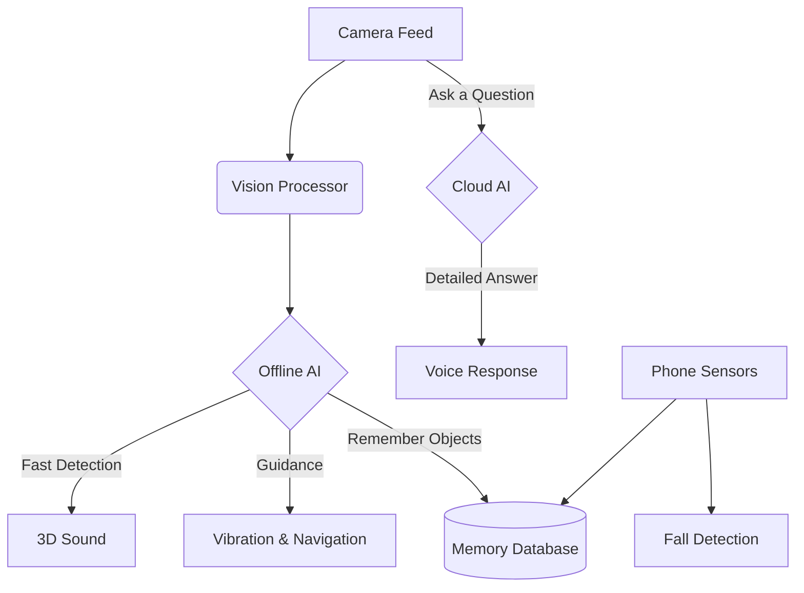
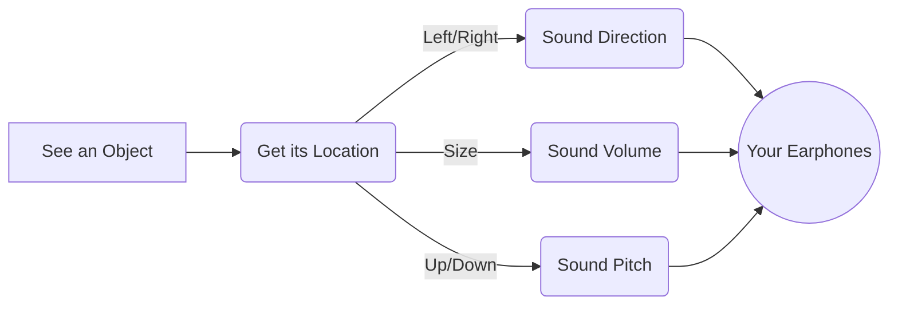
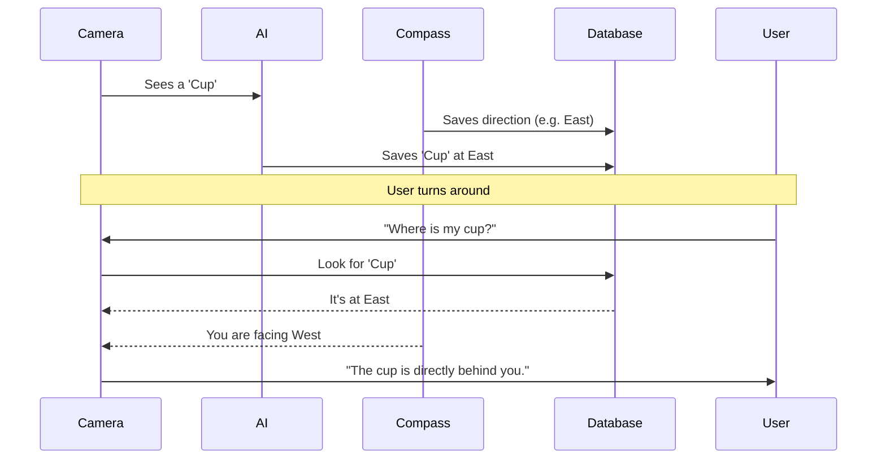
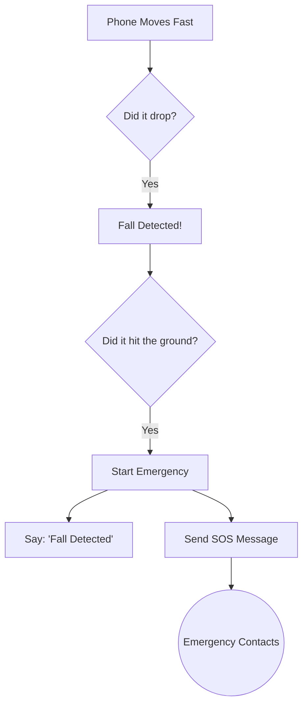

# VSense — An Assistive App for the Visually Impaired

  

A smart, voice-controlled Android app that helps visually impaired people navigate their surroundings safely. It acts as an intelligent assistant that can "see" objects, warn about obstacles, and guide the user.

---

## 🌟 What It Can Do

### 🧭 Easy Navigation
*   **🎧 3D Sound Feedback:** The app plays sounds to let you know exactly where objects are around you (left, right, near, or far).
*   **📍 Object Memory:** The app remembers where things are. If you walk past a cup, you can ask "Where is my cup?" and it will tell you.
*   **🔍 Find Mode:** Ask the app to "Find a door" or "Find a chair," and it will guide you to it using sound and vibrations.

### 🧠 Smart Vision
*   **📷 Instant Object Detection:** Uses the phone's camera to instantly spot obstacles and things in your path, without needing the internet.
*   **🖼️ Scene Description:** Ask "Describe what you see," and the app will tell you exactly what the room looks like.
*   **📖 Read Text (OCR):** Point the camera at a sign or book, and it will read the text out loud.
*   **😊 Facial Recognition:** Recognizes people you know when they are nearby and tells you their names.

### 🛡️ Safety First
*   **🎙️ Voice Control:** Control everything using just your voice. No need to look at the screen.
*   **🚨 Fall SOS:** If the phone detects you have fallen, it automatically sends an emergency SOS message to your contacts.
*   **🔦 Manual & Auto-Flashlight:** You can turn the flashlight on and off yourself with a voice command, or let the app do it automatically in the dark so the camera can keep seeing clearly.

---

## 🏗️ How It Works (Diagrams)

### 1. The Big Picture



### 2. How 3D Sound Works



### 3. Remembering Objects



### 4. Emergency Fall Detection



---

## 🛠️ Technology Used

| Part | Tech |
| :--- | :--- |
| **Language** | Kotlin |
| **UI** | Jetpack Compose |
| **Offline AI** | TensorFlow Lite, Google ML Kit |
| **Online AI** | Nvidia / Meta LLaMA |
| **Database** | Room (SQLite) |

---

## 🚀 How to Run It

1. **Download** this code to your computer.
2. Open it in **Android Studio**.
3. Let it finish loading.
4. Create a `local.properties` file in the root directory (if it doesn't exist) and add your API keys:
   ```properties
   TELEGRAM_BOT_TOKEN=your_telegram_bot_token
   TELEGRAM_CHAT_ID=your_telegram_chat_id
   NVIDIA_API_KEY=your_nvidia_api_key
   NVIDIA_META_API_KEY=your_nvidia_meta_api_key
   ```
5. **Run** it on a real Android phone (the camera and sensors won't work properly on an emulator).

---

## 🗣️ Voice Commands to Try

*   🗣️ *"Describe what you see"*
*   🗣️ *"Find a chair"*
*   🗣️ *"Where is my cup?"*
*   🗣️ *"Read"*
*   🗣️ *"Turn off flashlight"*
*   🗣️ *"Switch to spatial"* (for 3D sound)
